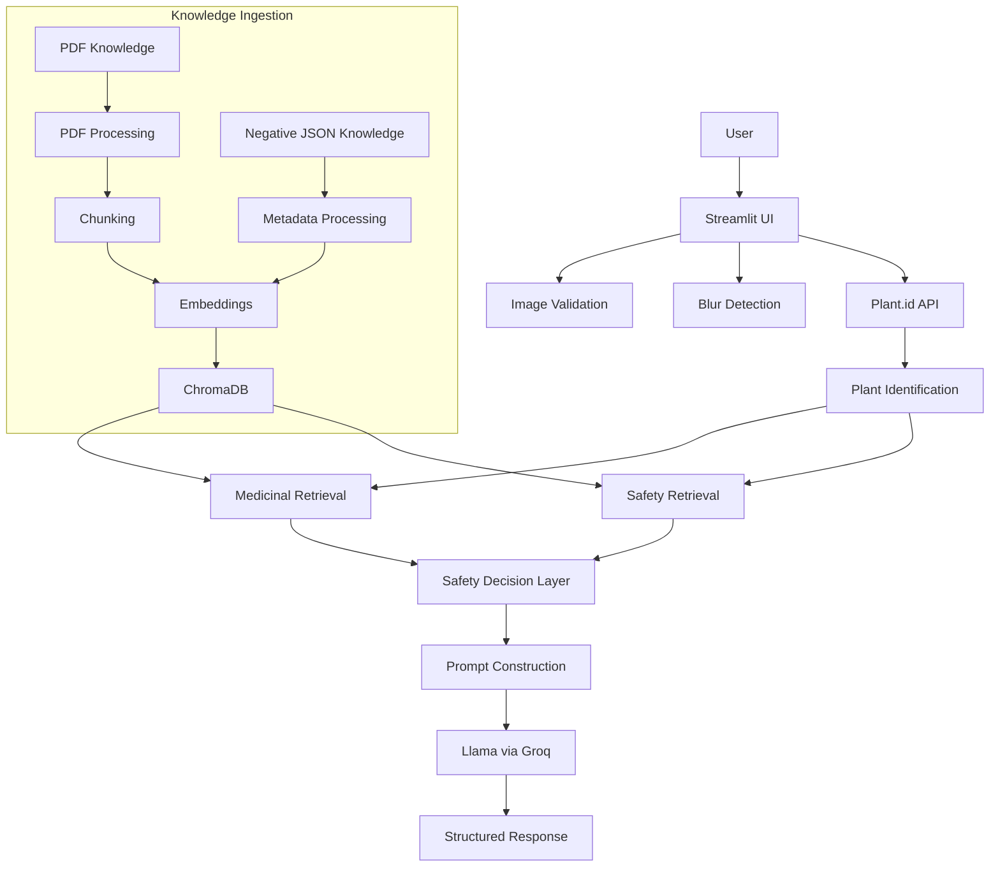
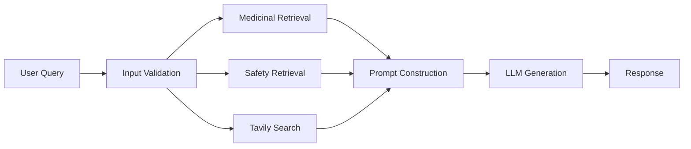

# Phytobot

AI-powered botanical assistant for plant identification, evidence-based herbal information, and safety-aware retrieval.

## Overview

Phytobot is an AI-powered botanical assistant that combines computer vision, retrieval-augmented generation (RAG), and a safety-aware knowledge architecture to help users identify plants and access medicinal information from authoritative sources. The system integrates plant identification with evidence-based herbal knowledge retrieval while explicitly separating botanical identification from medicinal safety assessment.

Users can upload plant images for identification or ask questions about medicinal herbs, symptoms, and traditional remedies. Phytobot retrieves information from WHO monographs, botanical encyclopedias, and curated safety databases, then uses an LLM to generate structured responses that clearly distinguish between authoritative evidence and traditional use. The system is designed for educational purposes and includes multiple safety layers to highlight potential toxicity, dangerous look-alikes, and contraindications.

## Problem

Simple plant identification systems are insufficient for safe botanical use. Identification alone does not establish medicinal safety—many plants have toxic parts, dangerous look-alikes, or context-dependent safety profiles. Botanical and medicinal information is often distributed across large PDF documents and specialized literature, making it difficult for users to access structured, evidence-based information. Users may encounter toxic plants or dangerous look-alikes without adequate warning, and traditional use should not be automatically treated as evidence of safety. There is a need for a system that provides structured access to both botanical knowledge and safety information while clearly distinguishing between authoritative evidence and anecdotal use.

## Solution

Phytobot addresses these challenges through a multi-layered architecture:

**Plant Identification**: Computer vision via Plant.id API with blur detection to ensure image quality before identification.

**Image Quality Validation**: OpenCV-based blur detection rejects poor-quality images before API calls.

**RAG Pipeline**: Retrieval-augmented generation with separate retrieval channels for medicinal evidence and safety-negative evidence.

**Medicinal Knowledge**: WHO monographs and herbal encyclopedia data ingested from PDFs, chunked, and embedded into ChromaDB.

**Safety / Negative Knowledge**: Structured JSON knowledge base containing toxic plants, toxic parts, dangerous look-alikes, and contraindications.

**Deterministic Safety Decision Layer**: Application logic evaluates safety evidence before LLM response generation, applying mandatory warnings for critical/high-risk plants and dangerous look-alikes.

**LLM Integration**: Llama 3.1-8b-instant via Groq generates structured responses with explicit safety blocks and medical disclaimers.

**Web Search Fallback**: Tavily search provides supplementary information when local knowledge is insufficient.

The safety architecture explicitly separates plant identification from medicinal safety assessment—identification confidence is not used as a safety score. The negative knowledge base contains curated toxicity information, but it is not exhaustive.

## Architecture



## Tech Stack

| Category         | Technology           | Purpose                     |
| ---------------- | -------------------- | --------------------------- |
| Language         | Python               | Application logic           |
| UI               | Streamlit            | Web interface               |
| Vision           | Plant.id API         | Plant identification        |
| Image Processing | OpenCV               | Blur detection              |
| LLM              | Llama 3.1-8b-instant | Response generation         |
| LLM Provider     | Groq                 | LLM inference               |
| RAG Framework    | LangChain            | Retrieval and orchestration |
| Embeddings       | all-MiniLM-L6-v2     | Semantic embeddings         |
| Vector Database  | ChromaDB             | Knowledge retrieval         |
| Web Search       | Tavily               | External search             |
| PDF Processing   | PyPDF/LangChain      | Knowledge ingestion         |
| Testing          | pytest               | Automated testing           |

## Key Features

- **Plant Identification**: Upload plant images for identification via Plant.id API with confidence scores
- **Image Quality Validation**: OpenCV-based blur detection rejects blurry images before identification
- **"Not a Plant" Detection**: Identifies when uploaded images do not contain plants
- **Medicinal Knowledge Retrieval**: Retrieves information from WHO monographs and herbal encyclopedia
- **Safety-Negative Knowledge**: Curated database of toxic plants, toxic parts, and dangerous look-alikes
- **Separate Retrieval Channels**: Medicinal evidence and safety evidence retrieved independently with metadata filtering
- **Deterministic Safety Decision Layer**: Application logic evaluates safety evidence before LLM response generation
- **Mandatory Safety Warnings**: Critical and high-risk plants trigger mandatory warnings before any medicinal information
- **LLM-Generated Structured Responses**: Llama 3.1 generates responses with explicit safety status blocks
- **Web Search Fallback**: Tavily search provides supplementary information when local knowledge is insufficient
- **Source Metadata Display**: Shows PDF sources and page numbers for retrieved information
- **Safety Disclaimer Enforcement**: Automatic medical disclaimers on all responses
- **Input Validation**: Text and image input validation with size limits and format checks
- **Error Handling**: Comprehensive error handling for API failures and timeouts
- **Logging**: Structured logging for debugging and monitoring

## AI Architecture

### Vision

Plant identification uses the Plant.id API v3 endpoint. Images are encoded as Base64 and sent with optional geographic coordinates. The API returns plant classifications with probability scores. Before identification, OpenCV calculates the Laplacian variance to detect blur—images below the threshold (default: 70) are rejected. The system also checks if the image contains a plant via the `is_plant.binary` field.

### Embeddings

The system uses the all-MiniLM-L6-v2 model to generate semantic embeddings. Document chunks from PDFs and negative knowledge entries are converted into 384-dimensional vectors, enabling semantic similarity search in ChromaDB. Embeddings are generated during knowledge ingestion and cached for efficient retrieval.

### RAG

PDF knowledge ingestion uses PyPDFLoader to extract text from WHO monographs and herbal encyclopedia documents. Text is split into chunks (1000 characters with 200-character overlap) using RecursiveCharacterTextSplitter. Chunks are embedded and stored in ChromaDB with metadata marking them as medicinal knowledge. Negative knowledge from JSON files is similarly processed with structured metadata including risk levels, safety status, and categories (toxic_plant, toxic_parts, dangerous_look_alike). Retrieval uses metadata filters to separate medicinal and safety channels, with top-k retrieval (k=3 for medicinal, k=3 for safety).

### LLM

Llama 3.1-8b-instant is hosted via Groq with temperature 0.1 for consistent responses. The prompt includes structured safety rules, retrieved medicinal context, safety context, web search results, and system-generated safety warnings. The LLM is instructed to follow critical safety rules: never infer medicinal safety from identification alone, never ignore toxicity information, distinguish traditional use from authoritative evidence, and prioritize safety warnings. The response structure includes plant identification, safety status, verified WHO/encyclopedia data, safety evidence, internet research, and a mandatory disclaimer block.

### Safety Decision Layer

Deterministic application logic in `safety_decision.py` evaluates safety evidence before the LLM generates the final response. The logic applies priority-ordered rules: dangerous look-alikes trigger the highest priority warnings, followed by critical/high toxicity, then caution_required status. Identification confidence below 70% triggers mandatory warnings. The system defaults to unsafe when evidence is insufficient. This deterministic layer ensures safety decisions are not delegated to the LLM.

## Data Flow

### Image Workflow


### Text Workflow



### Knowledge Ingestion


## Testing

The test suite currently includes 79 tests with the following results:

- **Collected**: 79 tests
- **Passed**: 79 tests
- **Skipped**: 1 test
- **Failed**: 0 tests
- **Warnings**: 1 deprecation warning (LangChain pydantic v1 compatibility)

Test coverage includes:

- Configuration validation (API, vector DB, LLM, vision, search, text, safety)
- Negative knowledge loading and entry conversion
- Safety disclaimer verification
- Safety decision logic (8 comprehensive scenarios including toxicity, look-alikes, low confidence)
- Conflict detection between medicinal and safety evidence
- Input validation (text length, image size, format verification)
- Vision module (blur detection, plant identification, API error handling)
- Failure scenarios (missing API keys, timeouts, malformed responses)

External APIs (Plant.id, Tavily, Groq) are mocked in tests where applicable. Code coverage percentage has not been measured.

## Security

- **Local Development**: API keys are stored in `.env` file, which is ignored by Git and not tracked in the repository
- **Production**: Streamlit Community Cloud provides environment variables/secrets management; no `.env` file is used in production
- **Secrets Management**: API keys are never hardcoded in source code; all keys are loaded via environment variables
- **Input Validation**: Text input length is limited (1000 characters); image uploads are validated for size (10MB max) and format
- **Image Validation**: Actual image content is verified using PIL to prevent format mismatches and corrupted files
- **API Timeout Handling**: All external API calls have configured timeouts (30s for Plant.id, 30s for Groq, 15s for Tavily)
- **Error Handling**: Comprehensive error handling prevents sensitive information from leaking in error messages
- **Logging**: No secrets or sensitive data are logged; error messages are descriptive but do not include credentials

## Deployment

### Primary Deployment Architecture

```
GitHub Repository
        ↓
Streamlit Community Cloud
        ↓
Phytobot Application
```

### Deployment Steps

1. **GitHub Repository**: Code is pushed to GitHub with:
   - `app.py` (entrypoint)
   - `requirements.txt` (dependencies)
   - `data/` (knowledge base PDFs)
   - `data/negative/` (safety knowledge JSON files)
   - `vector_db/` (pre-built vector database)

2. **Streamlit Community Cloud**:
   - Connect repository to Streamlit Community Cloud
   - Select `main` branch and `app.py` as main file
   - Configure secrets in Streamlit app settings:
     - `GROQ_API_KEY`
     - `PLANTID_API_KEY`
     - `TAVILY_API_KEY`
     - `VECTOR_DB_PATH` (optional, defaults to `./vector_db`)

3. **Vector Database Strategy**:
   - The repository includes a pre-built `vector_db/` directory committed to Git
   - This includes all embeddings from WHO monographs, herbal encyclopedia, and negative knowledge
   - No build step is required at deployment time
   - This ensures fast, reliable startup on Streamlit Community Cloud

4. **Knowledge Base Rebuild**:
   - To rebuild the vector database after updating knowledge base:
   ```bash
   python src/processor.py
   git add vector_db/
   git commit -m "Update vector database"
   git push
   ```

### GitHub Actions CI

The `.github/workflows/deploy.yml` workflow runs pytest on every push and pull request to the main branch. This serves as a quality gate but does not handle deployment—deployment is managed by Streamlit Community Cloud.

### Optional Docker Deployment

Docker is available for local development or alternative deployment platforms but is not required for the primary Streamlit Community Cloud deployment. The Dockerfile builds the vector database during image build using the `BUILDING_VECTOR_DB=1` environment variable to skip startup validation.

**Live demo**: Not yet available. Deployment to Streamlit Community Cloud is pending.

## Screenshots

Screenshots will be added after the first public deployment.

## Live Demo

Live demo: Not yet available. Deployment to Streamlit Community Cloud is pending.

## Engineering Challenges

- **Multi-API Integration**: Coordinating Plant.id (vision), Groq (LLM), and Tavily (search) APIs with different rate limits, timeout requirements, and error handling patterns
- **Image Quality Validation**: Implementing blur detection with OpenCV to reject poor-quality images before API calls, reducing costs and improving identification accuracy
- **RAG Pipeline Design**: Designing separate retrieval channels for medicinal and safety evidence with metadata filtering to ensure appropriate context for each
- **ChromaDB Ingestion**: Handling large PDF knowledge ingestion with batch processing (5000 chunks per batch) to avoid ChromaDB batch-size limitations
- **Large PDF Processing**: Processing multi-volume WHO monographs and a large herbal encyclopedia (65MB+) with efficient chunking and memory management
- **Safety-Negative Knowledge Integration**: Designing a structured JSON schema for toxic plants, toxic parts, and dangerous look-alikes with consistent metadata
- **Evidence Separation**: Distinguishing medicinal evidence from toxicity evidence in retrieval and ensuring the LLM does not conflate them
- **Deterministic Safety Logic**: Implementing priority-ordered safety rules that run before LLM generation to ensure critical warnings are never missed
- **Dependency Compatibility**: Managing compatibility between LangChain versions, Pydantic v1/v2 transition, and Python 3.12
- **Input Validation**: Implementing comprehensive validation for both text and image inputs to prevent abuse and ensure quality
- **API Failure Handling**: Designing graceful degradation when external APIs fail or timeout
- **Deployment Constraints**: Working around Streamlit Community Cloud limitations by committing a pre-built vector database to avoid build-time resource constraints

## What I Learned

Through building Phytobot, I gained practical experience with:

- **RAG Architecture**: Designing and implementing a retrieval-augmented generation pipeline with vector databases, embeddings, and metadata filtering
- **Vector Databases**: Using ChromaDB for semantic search with batch ingestion, metadata filtering, and persistence strategies
- **Embeddings**: Generating and using sentence embeddings with all-MiniLM-L6-v2 for semantic similarity search
- **Document Chunking**: Implementing recursive character text splitting with overlap for large PDF processing
- **LLM Orchestration**: Integrating Llama 3.1 via Groq with structured prompts, temperature control, and safety rules
- **Multimodal Integration**: Combining computer vision (Plant.id) with text-based RAG for a multimodal application
- **External API Handling**: Managing multiple external APIs with timeout handling, error recovery, and rate limit awareness
- **Safety-Aware AI Design**: Implementing deterministic safety logic separate from LLM generation to ensure critical warnings are never missed
- **Testing AI Integrations**: Writing comprehensive tests for AI components with mocked external APIs
- **Configuration Management**: Centralizing configuration with environment-specific handling for local development and production
- **GitHub CI**: Setting up continuous integration with pytest for automated testing on push/PR
- **Deployment Architecture**: Designing a deployment strategy for Streamlit Community Cloud with pre-built artifacts

## Future Improvements

- **Expand Negative Safety Knowledge**: Add more toxic plants, toxic parts, and dangerous look-alikes to the negative knowledge base
- **Improve Retrieval Quality**: Implement reranking or hybrid search (keyword + semantic) to improve retrieval precision
- **Embedding Model Evaluation**: Evaluate alternative embedding models for better semantic matching in the botanical domain
- **Retrieval Evaluation**: Implement systematic evaluation of retrieval quality with ground truth queries
- **Plant Identification Validation**: Add additional validation steps for plant identification, such as cross-referencing with botanical databases
- **Comprehensive Testing**: Expand test coverage to include end-to-end integration tests and retrieval quality tests
- **Monitoring and Observability**: Add logging, metrics, and monitoring for production deployment
- **Persistent User History**: Implement user sessions and query history for better context and UX
- **Authentication**: Add user authentication for personalized features and usage tracking
- **Scalable Vector Storage**: Evaluate cloud vector database options for larger knowledge bases and horizontal scaling

## AI-Assisted Development

AI coding assistants were used during development for tasks including:

- Repository analysis and code navigation
- Debugging and error resolution
- Test generation and test coverage expansion
- Implementation assistance for specific components
- Code review and refactoring suggestions
- Documentation and README improvements
- Deployment configuration troubleshooting

The project owner reviewed, tested, and decided which changes to keep. AI tools were used as part of the engineering workflow but did not independently design the system architecture or make engineering decisions.

## License

MIT License

Copyright (c) 2026 Phytobot

Permission is hereby granted, free of charge, to any person obtaining a copy of this software and associated documentation files (the "Software"), to deal in the Software without restriction, including without limitation the rights to use, copy, modify, merge, publish, distribute, sublicense, and/or sell copies of the Software, and to permit persons to whom the Software is furnished to do so, subject to the following conditions:

The above copyright notice and this permission notice shall be included in all copies or substantial portions of the Software.

THE SOFTWARE IS PROVIDED "AS IS", WITHOUT WARRANTY OF ANY KIND, EXPRESS OR IMPLIED, INCLUDING BUT NOT LIMITED TO THE WARRANTIES OF MERCHANTABILITY, FITNESS FOR A PARTICULAR PURPOSE AND NONINFRINGEMENT. IN NO EVENT SHALL THE AUTHORS OR COPYRIGHT HOLDERS BE LIABLE FOR ANY CLAIM, DAMAGES OR OTHER LIABILITY, WHETHER IN AN ACTION OF CONTRACT, TORT OR OTHERWISE, ARISING FROM, OUT OF OR IN CONNECTION WITH THE SOFTWARE OR THE USE OR OTHER DEALINGS IN THE SOFTWARE.
